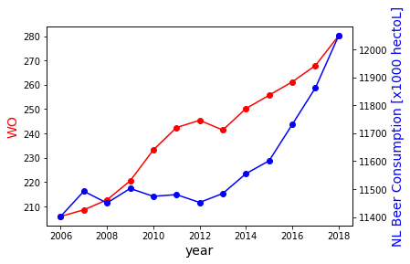

# L2: Tools for Computational Scientists #
## Assignment by Daan Vinken 12398233 ##

### Sources ###
* MCC Van Dyke et al., 2019
* JT Harvey, Applied Ergonomics, 2002
* DW Ziegler et al., 2005

### Result ###
